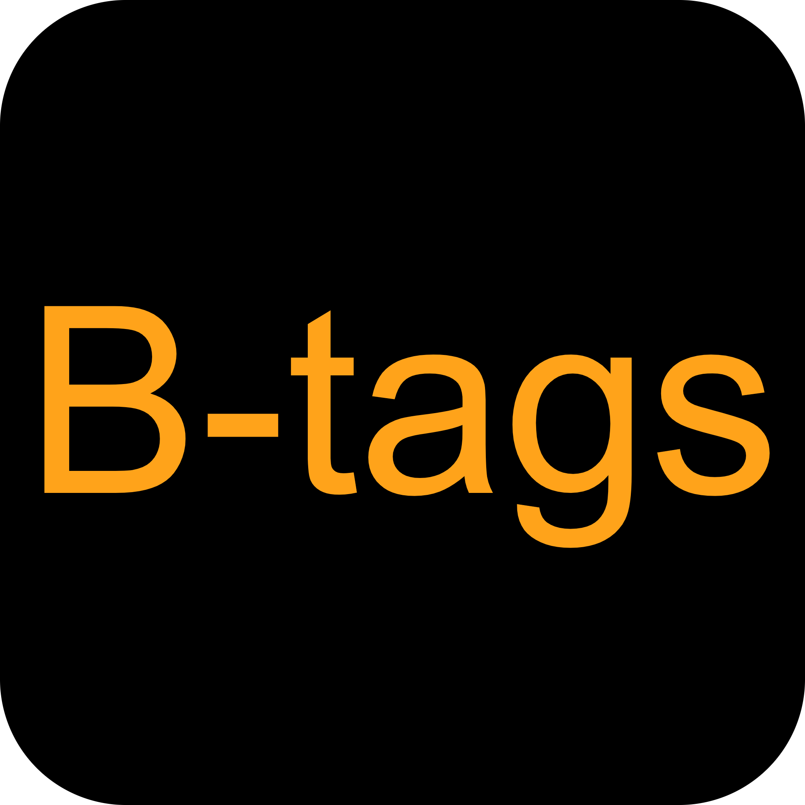

# B-tags

自媒体人如果想要优化自己的作品更容易上热门🔥那么选择一个好的视频标签很有必要😊

bilibili-hot-tags是一个根据关键词进行B站热门视频标签检索统计小工具🔧

这个工具可以帮助您输入视频关键词搜索B站热门视频标签🏷

<!-- PROJECT SHIELDS --

<!-- PROJECT LOGO -->

<br />

<p align="center">
  <a href="#">
    
  </a>

<h3 align="center">bilibili-hot-tags</h3>
  <p align="center">
    一个B站热门视频标签检索统计小工具
    <br />
    <a href="https://bilibili-hot-tags-git-master-ouzexis-projects.vercel.app/"><strong>点击进入 »</strong></a>
    <br />
    <br />
    <a href="https://github.com/ouzexi/bilibili-hot-tags/issues">报告Bug</a>
  </p>

</p>

 本篇README.md面向开发者

##### [前端仓库](https://github.com/ouzexi/bilibili-hot-tags)

### 使用指南

进入网站，输入你想要检索标签的视频关键词。比如，您想获取【羽毛球教学】该类视频的视频标签，那么您可以输入关键词【羽毛球教学】，点击 “搜索🔍”按钮。

搜索完成后饼图会将使用次数最多的10个标签（比如【"羽毛球", "教学", "体育"...】）统计结果可视化展示。您就可以将这10个标签加入到您的视频当中~👀

##### **开发步骤**

1、克隆项目

```sh
git clone https://github.com/ouzexi/bilibili-hot-tags-backend.git
```

2、下载依赖

```go
go mod tidy
```

3、启动项目

```go
go run main.go
```

3、打包项目

```go
// 如果将服务部署到Linux系统，请先执行以下命令，windows系统忽略
go env -w GOOS=linux
// 打包
go build main.go
```

### 接口文档

#### 1、历史版本

| 日期         | 版本号 | 作者     | 备注  |
| ---------- | --- | ------ | --- |
| 2024.11.27 | 1.0 | ouzexi | -   |

#### 2、中间件

| 名称                   | 作用        | 备注           |
| -------------------- | --------- | ------------ |
| RequestLogMiddleware | 打印请求日志    | 用于分析接口调用情况   |
| OriginMiddleware     | 限制访问来源    | 用于检查请求来源是否合法 |
| LimitHandler         | 限制最大并发连接数 | 使用令牌桶算法用于限流  |

#### 3、状态码说明

| 状态码 | 说明     |
| --- | ------ |
| 200 | 成功     |
| 500 | 参数校验出错 |
| 502 | 非法请求来源 |
| 503 | 请求频率限制 |
| 413 | 风险控制   |

#### 4、 返回信息

- 成功返回
  
  ```xml
  {
  "code": 200,
  "msg": "success msg,
  "data": data
  }
  ```

- 参数校验等错误返回
  
  ```xml
  {
  "code": 500,
  "msg": "tips msg"
  }
  ```

- 限流、非法请求来源或风控等错误返回
  
  ```xml
  {
  "code": 5XX,
  "msg": "fail msg"
  }
  ```

---

### 接口用法

#### 1、测试连通性

- **URL：**
  
  > [/ping](#)

- **支持格式：**
  
  > JSON

- **Method：**
  
  > GET

- **Request：** null

- **Response：**

| 返回参数       | 参数类型   | 参数名称 | 备注   |
| ---------- | ------ | ---- | ---- |
| msg        | string | 返回提示 | pong |
| User-Agent | string | 用户代理 | -    |

#### 2、获取标签统计

- **URL：**
  
  > [/bilibili-tags](#)

- **支持格式：**
  
  > JSON

- **Method：**
  
  > GET

- **Request：**

| 请求参数    | 参数类型   | 参数名称 | 备注            |
| ------- | ------ | ---- | ------------- |
| keyword | string | 关键词  | 必填            |
| order   | string | 排序规则 | 默认值 totalrank |

- **Response：**

| 返回参数 | 参数类型        | 参数名称   | 备注        |
| ---- | ----------- | ------ | --------- |
| msg  | string      | 返回提示   | 数据获取成功    |
| data | []ChartData | 标签统计列表 | 标签名称&统计数量 |

#### 3、更新Cookie

- **URL：**
  
  > [/update-cookie](#)

- **支持格式：**
  
  > JSON

- **Method：**
  
  > POST

- **Request：**

| 请求参数      | 参数类型   | 参数名称       | 备注  |
| --------- | ------ | ---------- | --- |
| cookieVal | string | 需更新的cookie | 必填  |

- **Response：**

| 返回参数 | 参数类型   | 参数名称 | 备注  |
| ---- | ------ | ---- | --- |
| code | number | 状态码  | 200 |

### 联系作者

[ouzexi](http://139.9.177.72/)

### 版权说明

该项目遵循MIT授权许可

### 特别鸣谢

- [bilibili-API-collect](https://github.com/SocialSisterYi/bilibili-API-collect)
